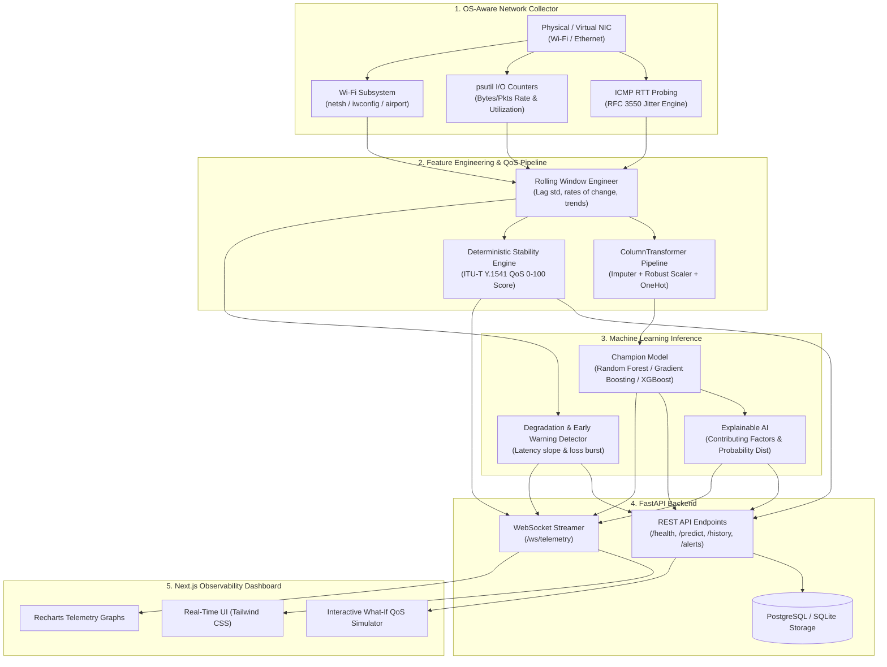

# AI-Based Network Connection Predictor

[](https://fastapi.tiangolo.com)
[](https://nextjs.org)
[](https://scikit-learn.org)
[](https://xgboost.readthedocs.io)
[](https://python.org)
[](LICENSE)

An end-to-end, production-grade network observability and predictive quality platform developed as a **Computer Networks** course project. The system continuously collects real-time physical/virtual network telemetry, performs rolling feature transformations, classifies connection quality into **GOOD**, **MODERATE**, or **POOR** via machine learning, evaluates a deterministic **Network Stability Score (0–100)**, detects early degradation trends, and explains inferences using Explainable AI (XAI).

---

## 1. System Architecture



---

## 2. Core Network Telemetry Features

| Parameter | Measurement Technique | Network Engineering Relevance |
| :--- | :--- | :--- |
| **Latency (RTT)** | Multi-probe ICMP echo timing (min, max, mean) | Transmission, propagation, and queuing delays. |
| **Packet Loss %** | Transmitted vs received probe ratio | Transmission line noise, queue overflow, congestion drop. |
| **Jitter (PDV)** | RFC 3550 Interarrival & Mean Packet Delay Variation | Buffer queuing variance; critical for VoIP/real-time traffic. |
| **Throughput (BW)** | Dynamic differential delta ($\Delta \text{bytes}/\Delta t$) | Available link capacity in Mbps. |
| **Wi-Fi RSSI** | Native OS queries (`netsh`, `iwconfig`, `airport`) | Physical wireless link signal attenuation (None for Ethernet). |
| **Interface Counters** | Cumulative byte and packet transfer tracking | Packet size averages and interface utilization. |
| **Link Utilization** | Throughput vs negotiated interface speed | Bottleneck identification and impending queue exhaustion. |

> **Missing Value Handling Principle:** RSSI is inherently unavailable on wired Ethernet. The system assigns a true `None` (null) with an explicit `signal_strength_missing` indicator and neutral imputation rather than fabricating artificial dummy numbers.

---

## 3. Mathematical Jitter Formulations

This platform implements standardized jitter calculations:

### A. Mean Absolute Packet Delay Variation (MAPDV / RFC 3393)
$$\text{MAPDV} = \frac{1}{N - 1} \sum_{k=1}^{N - 1} |RTT_{k+1} - RTT_k|$$

### B. RFC 3550 Statistical Jitter (Smoothed Interarrival Jitter)
$$J(i) = J(i - 1) + \frac{|D(i - 1, i)| - J(i - 1)}{16}$$
where $D(i - 1, i) = RTT_i - RTT_{i - 1}$.

---

## 4. Deterministic Network Stability Score (0–100)

Independent of the ML classification model, the system calculates a normalized deterministic Quality of Service (QoS) index based on ITU-T Y.1541 standards:

$$\text{Stability Score} = 100 - \left( P_{\text{loss}} + P_{\text{lat}} + P_{\text{jit}} + P_{\text{sig}} + P_{\text{util}} \right)$$

- **Packet Loss Penalty ($P_{\text{loss}}$):** Up to 35 points penalty (primary factor in TCP window collapse).
- **Latency Penalty ($P_{\text{lat}}$):** Up to 25 points penalty for excess delay above 20 ms.
- **Jitter Penalty ($P_{\text{jit}}$):** Up to 20 points penalty for packet delay variation above 2 ms.
- **Signal Quality Penalty ($P_{\text{sig}}$):** Up to 10 points penalty if Wi-Fi signal drops below 70% (0 penalty for wired Ethernet).
- **Interface Utilization Penalty ($P_{\text{util}}$):** Up to 10 points penalty when link utilization exceeds 80%.

---

## 5. Machine Learning Methodology & Benchmarks

5 distinct models were trained using 5-Fold Stratified Cross-Validation on a multi-scenario network dataset (6,000 samples). Validation selection was driven by **Macro F1 Score** (preventing majority-class bias):

| Algorithm | 5-Fold CV Macro F1 | Val Accuracy | Val Macro F1 | Held-Out Test Accuracy | Held-Out Test Macro F1 |
| :--- | :---: | :---: | :---: | :---: | :---: |
| **Random Forest (Champion)** | **0.9940** | **1.0000** | **1.0000** | **99.11%** | **98.83%** |
| **Gradient Boosting** | 0.9979 | 1.0000 | 1.0000 | 98.89% | 98.62% |
| **XGBoost** | 0.9963 | 1.0000 | 1.0000 | 98.89% | 98.62% |
| **Decision Tree** | 0.9943 | 0.9967 | 0.9956 | 98.44% | 98.11% |
| **Logistic Regression** | 0.9295 | 0.9456 | 0.9299 | 93.89% | 92.45% |

### Confusion Matrix on Held-Out Test Set (900 Samples)
- **GOOD:** 437 / 437 (100% Recall)
- **MODERATE:** 201 / 202 (99.5% Recall)
- **POOR:** 254 / 261 (97.3% Recall)

---

## 6. Getting Started Locally

### Prerequisites
- Python 3.12 or 3.13
- Node.js 18+ & npm

### A. Clone and Setup Environment
```bash
git clone <repo-url>
cd "CN Project"

# Python Virtual Environment
py -3.13 -m venv venv
# On Windows:
.\venv\Scripts\Activate.ps1
# On Linux/macOS:
# source venv/bin/activate

pip install -r backend/requirements.txt
```

### B. Start Backend Daemon
```bash
# Set PYTHONPATH to include backend
$env:PYTHONPATH="backend"
uvicorn app.main:app --host 0.0.0.0 --port 8000 --reload
```
API Documentation available at: [http://localhost:8000/docs](http://localhost:8000/docs)

### C. Start Next.js Frontend
In a new terminal window:
```bash
cd frontend
npm install
npm run dev
```
Dashboard available at: [http://localhost:3000](http://localhost:3000)

---

## 7. Running via Docker Compose

```bash
docker compose up --build
```
This automatically initializes:
1. PostgreSQL 16 database with health check
2. FastAPI backend on `http://localhost:8000`
3. Next.js frontend on `http://localhost:3000`

---

## 8. Running the Automated Test Suite

```bash
$env:PYTHONPATH="backend"
pytest tests/ -v
```
Runs 27 comprehensive tests validating mathematical jitter, OS collectors, feature engineering, ML models, degradation alert triggers, database operations, and REST APIs.
